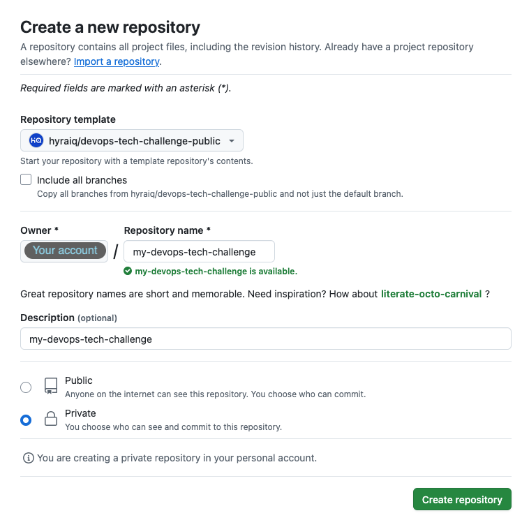
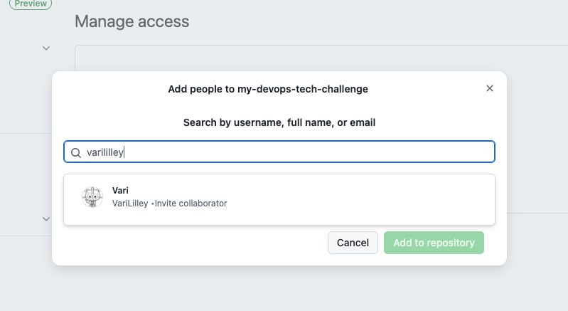

# DevOps Technical Challenge

## How to make a submission

When undertaking this challenge, please follow these steps:

1. **Do not fork this repository** - Instead, create a [private repository from this template](https://docs.github.com/en/repositories/creating-and-managing-repositories/creating-a-repository-from-a-template#creating-a-repository-from-a-template).

2. **Complete the challenge** and commit your changes to your private Github repository created from the template.
3. **Submit your work** by inviting `VariLilley` as a [collaborator](https://docs.github.com/en/account-and-profile/setting-up-and-managing-your-personal-account-on-github/managing-access-to-your-personal-repositories/inviting-collaborators-to-a-personal-repository#inviting-a-collaborator-to-a-personal-repository) to your repository.

4. **Review process** - We will create an internal pull request containing your changes for team review. Further communications will happen via your recruitment contact.

## Challenge Objective

This challenge presents you with a Docker based application stack that needs some key improvements to operate as expected. Your goal is to enhance the existing setup with optimal configuration and centralised logging capabilities.

The expectation is for this to take 1-2 hours to complete. Your submission will be referenced and discussed in your next technical interview.

You will need to modify the Docker configuration to implement the requirements while preserving full application functionality. The PHP application should handle file uploads and downloads without issue (Test files are included in `./test-uploads`).

This exercise represents a simplified application stack designed to run locally. The repository contains all necessary files for completion (excluding Docker container images), the your submission should also maintain this approach.

## Tasks to Complete

### 1. Domain Setup & HTTPS

- Configure nginx to serve the PHP application over HTTPS.
- Set up proper domain handling so the application is accessible *only* via `https://app.test/`.

### 2. NGINX + PHP-FPM configuration

- Configure nginx and PHP-FPM to properly handle file uploads without error.
- Apply these configurations at the web server and PHP layers without modifying the application code.
- Manually test the application to ensure all files in the `test-uploads/` folder upload successfully.

### 3. Centralized Application Logging

- Implement a dedicated container to capture, and forward application logs. Use the existing Openobserve setup to receive and store these logs.
- Configure log forwarding from the PHP application's log file at `/var/log/app/app.log`.
- Ensure logs are properly ingested into the log server and are correctly structured with appropriate levels, timestamps, and contextual information.

### 4. Documentation

- Document all configuration change you make in `setup.md`.
- Include explanations of:
  - The modifications made to each component of the stack.
  - How to set up the host system to access the application via the custom domain.
  - How to view and query the centralized logs.
  - Any additional measures implemented in your configuration.

## Provided Resources

- **Setup Instructions**
  `setup.md` - Document changes made and setup steps.

- **PHP Application Files**
  `app/index.php`, `app/app.phar` - A simple PHP interface for uploading files to an S3-compatible backend.
  - Generates logs via a custom function to `/var/log/app/app.log`.
  - *Do not edit these files.*

- **Challenge Instructions**
  `README.md`
  `docs/images/*` - Example screenshots.

- **Version Control**
  `.gitignore` - Files excluded from version control.

- **Test Files**
  `test-uploads/*` - Sample files for upload testing.

- **Docker Configuration**
  `docker-compose.yaml`

- **Docker Environment Variables**
  `.env`

- **Code Style**
  `.editorconfig`
